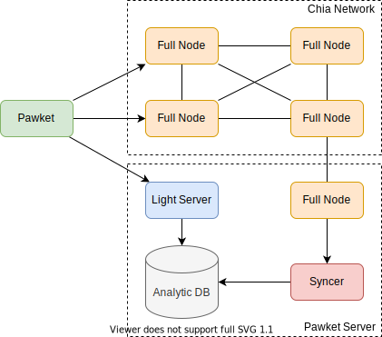
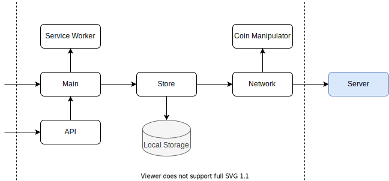

# Application Architecture

Some knowledge about the different layers of the application is needed to better understand the attack surface. This section briefly explains the overall software architecture of Pawket.

## Server

Pawket clients connect to the Light server by default, which provides a quick response without needing to synchronize the whole/selective blockchain.

The Light Server and the Syncer are developed in. Net Core 6.0, following the standard API design pattern. This server application relies on a Postgresql database, which cache and calculates the balance for clients.

Pawket clients are also allowed to connect to Full Node RPC, which could permit the client to connect to their trust Node to avoid API attacks. However, it could lose the benefit of the ability to get the balance quickly. 

With Pawket Light Server, even dusted accounts can get balance instantly, thanks to Analytic DB in the backend, which is storing the analytic result of on-chain data by Syncer.

The data stored in Analytic DB is like this:
(almost the same to the Chia SQLite DB)

```mermaid
erDiagram
    sync_coin_record {
        bigint id PK
        bytea coin_name
        bigint confirmed_index
        bigint spent_index
        bool coinbase
        bytea puzzle_hash
        bytea coin_parent
        bigint amount
        bigint timestamp
    }
    sync_hint_record {
        bigint id PK
        bytea coin_name
        bytea hint
    }
    sync_coin_record }o--o{ sync_hint_record : coin_name
    sync_coin_record }o--|{ sync_coin_record : coin_parent
```

## Web Client

All data are stored in localStorage, and the sensitive information is encrypted with the User Master Password.

The web client also accepts API calls.

## CLI

The `Coin Manipulator` can be reused to support CLI manipulation.

As Web Client is written in Typescript (a dialect of Javascript), it can be easily migrated to run in CLI with nodejs.

